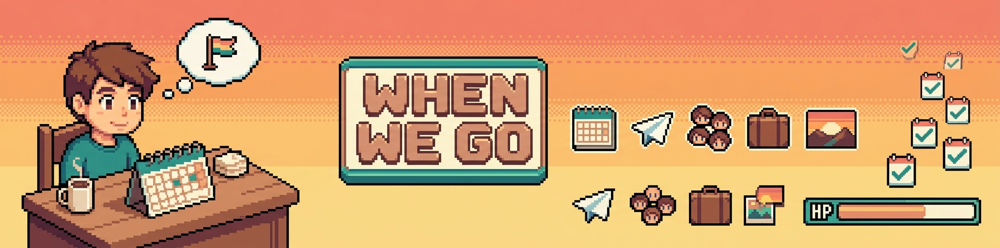

<div align="center">



# 🗓️ when-we-go

**A tiny, friend-shaped microsite for figuring out when a small group can actually go on a trip together.**

Per-person URL · tappable calendar (yes / maybe / no) · automatic overlap detection · organiser dashboard · auto-close · Telegram pings · zero accounts.

[](https://when-we-go-demo.pages.dev/copenhagen-2026/EXAMPLE_TOKEN_LEO_REPLACE/)

[](#license)
[](https://astro.build/)
[](https://tailwindcss.com/)
[](https://workers.cloudflare.com/)
[](https://www.typescriptlang.org/)
[](#what-youll-need)

**Live demo:** [Leo](https://when-we-go-demo.pages.dev/copenhagen-2026/EXAMPLE_TOKEN_LEO_REPLACE/) · [Sister](https://when-we-go-demo.pages.dev/copenhagen-2026/EXAMPLE_TOKEN_SISTER_REPLACE/) · [Dad](https://when-we-go-demo.pages.dev/copenhagen-2026/EXAMPLE_TOKEN_DAD_REPLACE/) · [Brother](https://when-we-go-demo.pages.dev/copenhagen-2026/EXAMPLE_TOKEN_BROTHER_REPLACE/) · [Admin](https://when-we-go-demo.pages.dev/copenhagen-2026/admin/EXAMPLE_ORG_TOKEN_REPLACE/)

</div>

Built for the awkward "okay but which weekend actually works for everyone" group of 3-8 friends or family members — **not** for a public calendar product. Self-hosted on Cloudflare's free tier; total monthly cost is €0 unless you do something exotic.

All personal data has been stripped from this template; you provide your own poll (slug, title, destination, date range, participants) and optional Telegram bot.

> **It's a coordination tool, not a calendar service.** No accounts, no profiles, no invitations. Per-token URLs are the only identity — each participant gets one, and that URL *is* their vote. The whole point is to be the smallest possible thing that fits "we need to pick a weekend".

---

## Contents

- [Five ways to use this](#five-ways-to-use-this)
- [Stack](#stack)
- [What you'll need](#what-youll-need)
- [Quick start (local dev)](#quick-start-local-dev)
- [Deploying (Cloudflare)](#deploying-cloudflare)
- [Replacing the pixel art](#replacing-the-pixel-art)
- [Open Graph link previews](#open-graph-link-previews)
- [Attribution footer](#attribution-footer)
- [Customising the copy](#customising-the-copy)
- [Live demo (run it yourself)](#live-demo-run-it-yourself)
- [Architecture](#architecture)
- [Pre-launch checklist](#pre-launch-checklist)
- [Data retention](#data-retention)
- [Troubleshooting](#troubleshooting)
- [License](#license) · [Sibling project](#sibling-project) · [Contributing](#contributing)

---

## Five ways to use this

The template ships with the original "family-of-four needs to pick a Copenhagen weekend" framing — but the underlying mechanic (per-token URL + tap-cycle calendar + automatic overlap + organiser ping) works for any scenario where a small known group has to converge on one date or one weekend. Five concrete riffs:

### 1. ✈️ The Copenhagen family trip

Four people, one shared trip, and four very different calendar realities — one's a parent, one's mid-thesis, one runs their own shop, one is between things. You don't want to be the person nagging in the family WhatsApp for two weeks. Each person gets their own URL with a tappable calendar over the candidate range. They open it once, tap the days that work, close the tab. When the polling window ends, you see the dates everyone said yes to — or, if nothing is unanimous, the closest near-misses. (*This is what the original site was built for.*)

### 2. 💍 Wedding date check

You and your partner have narrowed it down to two or three candidate weekends, and now both families need to weigh in before you call the venue. Generate one poll with the candidate weekends as the date range, send a personal URL to each parent / sibling / would-be best person. No one has to install anything, no one creates an account, no one sees anyone else's vote. You see the overlap, you pick the weekend, you call the venue. Done in three days instead of three weeks of group chats.

### 3. 🎪 Annual reunion / Klassentreffen

Twelve people who haven't all been in the same room since high school want to reunite. The classic problem: every proposed weekend is the one weekend two specific people genuinely can't. Instead of forty-three WhatsApp messages, send each person a URL, give them ten weekends to look at, set the poll to close in two weeks. The admin dashboard shows you who hasn't voted yet so you can poke just them, not the whole group.

### 4. 🏔️ Festival weekend / ski trip / cabin booking

Six friends, three candidate weekends, one cabin that needs to be booked soon. The whole group has the same broad availability ("a weekend in March") but the specifics matter — the cabin's only open weekends 1 and 3, friend A is travelling weekend 2 anyway. You want a fast yes/maybe/no across three options without holding a Doom poll on Discord. Polling closes Sunday night; Monday you book.

### 5. 🛠️ Workshop / studio retreat scheduling

You run a small design studio or consultancy, and once a year you try to take the whole team somewhere for two days of strategy and walks. Six to ten people, every one of them with active client work. You need the one Thursday-Friday over the next quarter where everyone can actually step out. Per-person URLs go in a single Slack thread, calendar opens to the next 90 days, organiser sees overlap, books the train tickets.

> ✨ **Got another use case?** Open an issue with a one-line description — if it stretches the template's range, it goes here.

---

## Stack

- **[Astro 6](https://astro.build/)** — static output, `getStaticPaths()` for per-token HTML
- **[Tailwind v4](https://tailwindcss.com/)** via `@tailwindcss/vite` (CSS-first config)
- **[Cloudflare Pages](https://pages.cloudflare.com/)** — static hosting + git integration
- **[Cloudflare Workers](https://workers.cloudflare.com/) + [Durable Objects](https://developers.cloudflare.com/durable-objects/) (SQLite)** — vote persistence, overlap calc, admin endpoints, hourly auto-close cron
- **[Telegram Bot API](https://core.telegram.org/bots/api)** — optional organiser pings on first-vote + poll close
- **[Satori](https://github.com/vercel/satori) + [@resvg/resvg-js](https://github.com/yisibl/resvg-js)** — build-time per-poll Open Graph PNGs (1200×630, baked into `dist/og/`)
- **[nanoid](https://github.com/ai/nanoid)** — URL-safe tokens (16 chars for participants, 22 for organisers)

Zero client-side framework runtime. The calendar grid is one hand-written `<script>` island — tap to cycle `unset → yes → maybe → no → unset`, debounced 500 ms before it POSTs to `/api/vote`. Production page weighs ~40 KB gzipped.

---

## What you'll need

- **Node.js 22.12+** (`.nvmrc` pins 22.16.0 to match Cloudflare Pages' build image)
- **A Cloudflare account** (free tier is fine) with a domain on Cloudflare DNS — only needed if you want the Worker (vote persistence + admin); static-only deployments work on any host
- **A GitHub account** (free, public or private repo both work)
- **(Optional) A Telegram bot** for instant notifications — created via [@BotFather](https://t.me/BotFather) in ~2 minutes
- **A small group of 3-8 people who all use a phone** — bigger groups work but the UI is tuned for "round of family/friends", not "company-wide all-hands"

---

## Quick start (local dev)

```bash
# 1. Clone + install
git clone https://github.com/<you>/<repo>.git when-we-go
cd when-we-go
npm install

# 2. Generate your first poll (interactive — asks for title, dates, participants)
npm run gen-poll
# → writes data/polls.json with secure nanoid tokens

# 3. (Optional, alternative) Seed from the example
cp data/polls.example.json data/polls.json
# Edit data/polls.json — replace the EXAMPLE_TOKEN_*_REPLACE strings with
# real ones generated via `npm run gen-poll` (or any nanoid generator).

# 4. Copy + fill in env vars
cp .env.example .env
# Open .env and set PUBLIC_SITE_URL=http://localhost:4321 (already default).

# 5. Run the static site
npm run dev
# → http://localhost:4321/<your-slug>/<participant-token>/
# → http://localhost:4321/<your-slug>/admin/<organizer-token>/

# 6. (Optional) Run the Worker locally in another terminal
npm run worker:dev
# → http://localhost:8787
```

Open the per-token URL in the browser. You should see the greeting, the countdown, and the tappable calendar grid. Tap any day cell to cycle through states — the bottom-left status badge briefly flashes `saving…` then `saved` as the debounced POST lands in your local Worker.

> **`#` in your project path?** Vite's virtual-module resolver chokes on `#` characters in the absolute path. If `npm run dev` fails with a Rollup error mentioning a `#`, mirror the source to a `#`-free directory (e.g. `C:\dev\when-we-go`) and run from there. Cloudflare Pages builds are unaffected.

To verify cross-poll isolation in the built `dist/` (each participant page must not leak any other poll's slug / participant names / tokens):

```bash
npm run verify-isolation
```

To render the loud "DEMO POLL" banner at the top of every page (for showcase deployments):

```bash
WHENWEGO_DEMO_MODE=true npm run build
```

---

## Deploying (Cloudflare)

You deploy two things separately: the **static site** (Cloudflare Pages, pulls from GitHub on every push) and the **Worker + Durable Object** (deployed manually with `wrangler deploy`). They share the same custom domain via routes — the Worker matches `/api/*` because it's more specific, the Pages site serves everything else.

### 1. Create the Cloudflare Pages project

1. Push the repo to GitHub.
2. Cloudflare Dashboard → Workers & Pages → Create application → Pages → Connect to Git.
3. Select your repo, then in build settings:
   - **Framework preset:** Astro
   - **Build command:** `npm run build`
   - **Build output directory:** `dist`
   - **Root directory:** `/` (project root)
4. Settings → Environment variables → Production: add every key listed in `.env.example`, especially `WHENWEGO_POLLS_JSON` (this is the JSON string the prebuild script reads at CI time — keep `data/polls.json` gitignored locally, paste the same content here for prod). Also set `PUBLIC_SITE_URL=https://when.your-domain.com` so the Open Graph link-preview tags resolve to absolute URLs.
5. Trigger the first deploy. Visit `https://<your-project>.pages.dev/<slug>/<participant-token>/` to verify.
6. Settings → Custom domains → add your domain (e.g. `when.your-domain.com`).

### 2. Configure + deploy the Worker

The Worker is what the calendar JS calls on every debounced tap — it writes to a Durable Object (one per poll, keyed by slug), recomputes who has voted, and fires Telegram notifications. It also runs the hourly cron that auto-closes overdue polls.

Edit `wrangler.toml` and replace the route placeholders:

```toml
[[routes]]
pattern = "when.your-domain.com/api/*"
zone_name = "your-domain.com"
```

Then set the secrets the Worker needs:

```bash
npx wrangler secret put WHENWEGO_POLLS_JSON       # same JSON as the Pages env var

# Optional — only if you want notifications:
npx wrangler secret put WHENWEGO_TELEGRAM_BOT_TOKEN
npx wrangler secret put WHENWEGO_TELEGRAM_CHAT_ID
```

Deploy:

```bash
npm run worker:deploy
```

Verify the route works:

```bash
curl https://when.your-domain.com/api/health
# {"ok": true, "phase": 2}
```

### 3. (Optional) Set up Telegram notifications

1. Message [@BotFather](https://t.me/BotFather) → `/newbot` → name it whatever (e.g. `my-when-we-go-bot`).
2. BotFather sends back a bot token — copy it.
3. Get your chat id: message the bot once, then visit `https://api.telegram.org/bot<TOKEN>/getUpdates` and look for `"chat":{"id":...}`.
4. `npx wrangler secret put WHENWEGO_TELEGRAM_BOT_TOKEN` → paste the bot token.
5. `npx wrangler secret put WHENWEGO_TELEGRAM_CHAT_ID` → paste the chat id.

When the first vote lands on a poll you'll get a one-line ping like:

```
🗳️ Sister voted on copenhagen-2026 (3 of 4 voters now in)
```

When the cron auto-closes a poll you'll get the summary:

```
🎉 copenhagen-2026 closed. Perfect dates: Jul 12-15 (4 days). With effort: Jun 28 - Jul 5 (8 days).
```

### 4. Run the smoke test

```bash
SMOKE_BASE=https://when.your-domain.com \
SMOKE_SLUG=<your-slug> \
SMOKE_PARTICIPANT_TOKEN=<participant-token> \
SMOKE_ORGANIZER_TOKEN=<organizer-token> \
npm run smoke
```

Green output = ready to send the links.

---

## Replacing the pixel art

The repo ships a placeholder banner PNG so the README looks right out of the box. One asset is visible:

| Path | Size | Purpose |
|---|---|---|
| `public/banner.png` | 1280×320 | Wide banner shown at the top of this README |

If you fork and want a new banner that matches your own group's vibe:

### Suggested prompt (nano-banana, Aseprite, Midjourney, whatever)

```
Pixel art wide horizontal banner, 1280x320, transparent or warm-sunset background.
Left: a small pixel character at a desk with a calendar open.
Center: chunky pixel-font sign "WHEN WE GO".
Right: 4-5 NES-style icons — calendar, plane, suitcase, group of figures, sunset/destination.
Far right: a pixel HP-bar-style progress indicator showing dates filling in.
Warm sunset palette with teal accent (rust, ochre, peach, teal-blue).
Crisp 1px outline, no anti-aliasing, no gradients.
Aesthetic: 16-bit RPG town board, GBA-era.
```

Save it at `public/banner.png`. The build doesn't care about the exact dimensions — the README just renders whatever's there at the top.

The participant + admin pages themselves are deliberately illustration-light: the visual focus is the calendar grid + the greeting. No per-participant avatars to manage.

---

## Open Graph link previews

Every per-slug URL gets a **per-poll 1200×630 PNG** generated at build time and wired into the `<meta property="og:image">` tag. When the link is shared in WhatsApp / iMessage / Slack / Twitter, the preview card shows the poll title + destination + participant count + days-remaining — instead of a generic "when-we-go" fallback.

Implementation: Satori turns a JSX-ish layout into SVG, [@resvg/resvg-js](https://github.com/yisibl/resvg-js) rasterises it to PNG. No external service, no runtime cost — everything is pre-rendered into `dist/og/<slug>.png` during `astro build`.

To customise the design, edit `src/pages/og/[slug].png.ts`. Bundle a different font in `public/fonts/` and update the `fontPath` constant if you want a different look.

**Important:** set `PUBLIC_SITE_URL=https://when.your-domain.com` at build time so the `<meta>` tags resolve to absolute URLs (link-preview crawlers require this).

---

## Attribution footer

Every page rendered by this template ships with two small strips at the very bottom:

> 💸 *Need to split costs after the trip?* → **pay-me-back**
>
> 🗓️ Built with **when-we-go** — pick a trip date together

The first is a cross-link to the [sibling project](#sibling-project). The second links back to this GitHub repo so visitors who like the site can find the source and build their own.

Both are **on by default but easy to remove** — set `WHENWEGO_HIDE_FOOTERS=true` as a build-time env var to suppress both, or delete the corresponding `<aside>` / `<footer>` blocks at the bottom of `src/layouts/BaseLayout.astro`.

The MIT license technically only requires the copyright notice in the source code, not in the output. Keeping the footer is appreciated but not required. If you do customise it (e.g. point it to your own fork), please leave at least a single link back to this repo somewhere on the site so the chain stays discoverable.

---

## Customising the copy

User-facing strings live in `src/components/*.astro`, `src/pages/[slug]/[token].astro`, and `src/pages/[slug]/admin/[token].astro`. They're in English. Translate freely — feel free to write per-poll titles in whatever language each group actually uses (the slug stays URL-safe ASCII, but the `title` and `destination` fields render whatever Unicode you put in them).

The greeting line ("Hey \<name\> — when can you come to \<destination\>?") lives in `src/pages/[slug]/[token].astro` near the top. Swap it for your own tone in one place; every participant page picks it up.

---

## Live demo

A demo instance is deployed at **[when-we-go-demo.pages.dev](https://when-we-go-demo.pages.dev/copenhagen-2026/EXAMPLE_TOKEN_LEO_REPLACE/)** — click any of the four placeholder participants to see the per-token page, or `/copenhagen-2026/admin/EXAMPLE_ORG_TOKEN_REPLACE/` for the organiser dashboard. The calendar taps don't persist because there's no Worker behind the demo (the demo is static site only); the calendar JS logs an error to the console when its POST fails, which is fine for a UI showcase.

To spin up your own demo against your own Cloudflare account:

```bash
# After cloning + npm install + npm run build:
npx wrangler pages deploy dist --project-name=when-we-go-demo
```

CF returns a `https://when-we-go-demo.pages.dev` URL on first deploy. The demo doesn't include the Worker — that's a separate `npm run worker:deploy`. Both are documented in [Deploying (Cloudflare)](#deploying-cloudflare).

---

## Architecture

```
data/polls.json                gitignored — real PII (names + tokens); mirror to CF env var
data/polls.example.json        committed — placeholder Copenhagen poll for first-clone demos
src/data/polls.ts              typed shim that imports the JSON above
src/pages/
  index.astro                  landing ("wrong door" — visitors without a token get nothing)
  404.astro
  [slug]/
    [token].astro              per-participant page; getStaticPaths walks polls × participants
    admin/
      [token].astro            organiser dashboard, gated by organizerToken
  og/
    [slug].png.ts              build-time OG image generator (Satori + Resvg)
src/components/
  PollHeader.astro             greeting + destination + countdown badge
  CalendarGrid.astro           visual grid, week-rowed, month-divider rows
  CopyButton.astro             share-this-URL helper
src/lib/
  calendar.ts                  pure date helpers (enumerate, weekify, daysUntil)
  copy.ts                      copy-to-clipboard helper
worker/
  index.ts                     router — 5 endpoints (see below)
  durable-object.ts            SQLite DO: votes, vote_history, poll_meta
  scheduled.ts                 hourly cron: auto-close + summary Telegram ping
  handlers/
    poll.ts                    GET /api/poll       — participant view
    vote.ts                    POST /api/vote      — bulk replace participant's votes
    admin-poll.ts              GET /api/admin/poll — organiser aggregate
    admin-close.ts             POST /api/admin/close — force-close
    health.ts                  GET /api/health     — smoke test target
  lib/
    overlap.ts                 pure overlap-calc (unit-tested via node --test)
    polls-config.ts            parses WHENWEGO_POLLS_JSON env secret
    cors.ts                    same-origin + configurable extras
    notify-pipeline.ts         Telegram (best-effort, never blocks API)
    schemas.ts                 Zod request validation
scripts/
  prebuild-polls.mjs           CI: WHENWEGO_POLLS_JSON → data/polls.json
  gen-poll.mjs                 local: scaffold new poll with secure tokens
  verify-isolation.mjs         build-time cross-poll leak detector
  smoke-test.mjs               end-to-end curl checks
```

The five API endpoints:

| Method | Path | Auth | Purpose |
|---|---|---|---|
| `GET`  | `/api/poll?slug=X&token=Y`     | participant token (query) | Viewer's own votes + poll meta. Post-close, also returns overlap. |
| `POST` | `/api/vote`                    | participant token (body) | Bulk replace viewer's votes. Idempotent. Triggers first-vote ping. |
| `GET`  | `/api/admin/poll?slug=X`       | `X-Organizer-Token` header | Aggregate per-date breakdown + voter list + overlap. |
| `POST` | `/api/admin/close?slug=X`      | `X-Organizer-Token` header | Force-close, skipping the cron. |
| `GET`  | `/api/health`                  | none | Returns `{ok: true, phase: 2}`. Smoke target. |

The Durable Object is keyed by `slug` (one DO per poll). Votes live in a `(token, date)` SQLite table inside the DO; the schema is lazy-initialised on first write. Closing a poll computes the overlap once and caches it in `poll_meta` so subsequent reads are O(1).

---

## Pre-launch checklist

Before you actually send the links:

- [ ] All real poll data is in CF Pages env vars + Worker secrets, not in the repo
- [ ] `data/polls.json` shows up in `git status --ignored` (= it's gitignored)
- [ ] `PUBLIC_SITE_URL` matches your real production domain (Open Graph cards depend on it)
- [ ] `pollCloseAt` in each poll has an explicit TZ offset (e.g. `+02:00`), not just `Z`
- [ ] `npm run verify-isolation` passes after `npm run build`
- [ ] `npm run smoke` is green against the production URL
- [ ] One real test vote fires a Telegram message you actually receive (if configured)
- [ ] The admin page (`/<slug>/admin/<token>/`) loads and shows the participant list
- [ ] A fake admin URL (`/<slug>/admin/wrong-token/`) returns 404, not 200 with an empty page
- [ ] The "share this URL" copy button works on the real device your group uses (Safari iOS especially)

---

## Data retention

The whole point of self-hosting is that you own the cleanup. When the trip is booked and the poll has done its job:

1. Delete the Durable Object data:
   ```bash
   npx wrangler delete --name when-we-go-api
   # then re-deploy a fresh empty Worker if you want to keep the endpoint alive for other polls
   ```
2. Remove the poll from `WHENWEGO_POLLS_JSON` in the CF Pages + Worker secrets, redeploy.
3. Delete the per-poll OG image: `dist/og/<slug>.png` is rebuilt on every deploy anyway; the next build won't generate one for a removed poll.
4. (Optional, paranoid) Rotate `WHENWEGO_TELEGRAM_BOT_TOKEN` — message [@BotFather](https://t.me/BotFather) → `/token`.

Votes are stored as `(token, date, state)` rows — no IP addresses, no User-Agent strings, no analytics cookies. The only PII is whatever names you put in the poll JSON.

---

## Troubleshooting

| Symptom | Cause | Fix |
|---|---|---|
| `npm run dev` fails with "Cannot find module" referencing a `#` | `#` in absolute project path breaks Vite | Mirror to a `#`-free directory (see Quick start) |
| Build fails with "WHENWEGO_POLLS_JSON env var missing" | Prebuild script needs either a local `data/polls.json` or the env var | Set it in CF Pages dashboard, or run `cp data/polls.example.json data/polls.json` locally |
| Build fails with "poll slug is a reserved word" | Slug uses one of `admin`, `api`, `404`, `favicon`, `robots`, `sitemap`, `og` | Pick a different slug — these names collide with file-system routes |
| Per-token page returns 404 in dev after editing `polls.json` | Astro caches `getStaticPaths` results | Restart `npm run dev` |
| Worker route returns 404 in prod | `wrangler.toml` route pattern doesn't match the hostname | Verify `pattern` in `wrangler.toml` matches your custom domain exactly, then `npm run worker:deploy` |
| Calendar tap shows "save failed — retry" forever | Worker `/api/vote` is unreachable | Check `curl https://when.your-domain.com/api/health`; if 404, the Worker isn't deployed or the route is wrong |
| Tapping a cell does nothing visually | Static-only deploy with no Worker (e.g. the demo) | Expected — the JS POST fails silently and logs to console. Deploy the Worker to enable persistence. |
| Telegram notification never arrives | Bot token / chat id wrong, or both env vars unset | Re-run the `getUpdates` curl from the Telegram setup section. Notifications are best-effort and never block the API response. |
| Auto-close cron didn't run | CF cron triggers are async + can be delayed up to a few minutes; also requires `WHENWEGO_POLLS_JSON` to be set in the Worker (not just Pages) | Check the Worker logs: `npx wrangler tail`. Run `/api/admin/close` manually to force. |
| OG preview shows wrong image / generic site title | `PUBLIC_SITE_URL` wasn't set at build time, so meta tags are relative | Set `PUBLIC_SITE_URL=https://when.your-domain.com` in CF Pages env vars and redeploy |
| `npm run verify-isolation` reports a leak | A participant name from another poll appears in this poll's HTML | Usually a real bug; if it's a false-positive on a structural string (e.g. github username), tighten the regex in `scripts/verify-isolation.mjs` |

---

## License

MIT — do whatever, just don't blame me when your friends still can't agree on a weekend.

---

## Sibling project

Part of a small "friend-sized internet" series. Sister tool: **[pay-me-back](https://github.com/Leonardboeker/pay-me-back)** — same group-of-friends shape, same Astro + Cloudflare stack, same pixel-art aesthetic.

- `when-we-go` figures out **when** the group is going (this repo).
- `pay-me-back` figures out **who pays what** once the trip is over (or before).

The two are intentionally designed with the same conventions so they compose: in a planned future phase, a closed `when-we-go` poll can spawn a `pay-me-back` instance pre-populated with each trip participant as a debtor. Not built yet — that's a natural post-MVP follow-up.

---

## Contributing

This is a personal toolkit released as a template, not an actively-maintained product. PRs that fix bugs or genuinely generalize a Leo-specific quirk are welcome; PRs that add scope (auth, multi-tenancy, time-of-day granularity, calendar imports) are probably not. Fork it.
